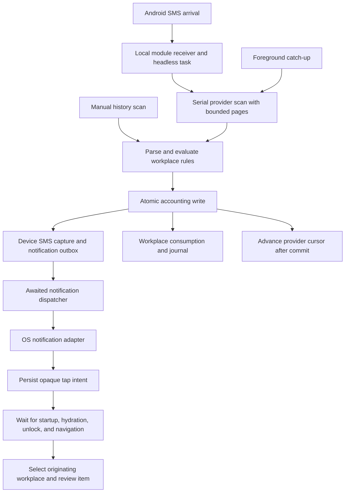

# SMS review notifications: fixes and release evidence

Updated October 2, 2026. Scope: the original 51 staged, uncommitted files and the SMS capture, rules, inbox, privacy, preferences, notifications, and composer handoff that they depend on. Fixes remain uncommitted on top of that work.

**Verdict: the identified code defects are fixed.** Validation covers database migrations, retries, consent, routing, privacy, ownership, pagination, native compilation, and an Android SMS broadcast followed by a cold-launch notification tap. This is not a signed production release or an OEM device certification.

## Architecture and ownership

There are four boundaries:

- **Device capture:** `DeviceSmsInboxRepository` owns shared SMS identity, parsed captures, provider aliases, per-workplace review hints, and durable notification receipts. Pending SMS are available across workplaces. Full sender/body identity coalesces provider redeliveries within a bounded window; equal amounts alone are insufficient. Original sender and message content stay locally available after import or auto-posting. New workplace copies reference the Device source; journal details and explicit backups resolve that source. Legacy source fields are preserved.
- **Workplace handling:** `TransactionInboxRepository` exposes immutable snapshots combining the Device feed with workplace consumption. A workplace copy is created on import, auto-post, or dismissal. Other workplaces show where a message was already handled. Cross-workplace automatic reposting is blocked; a deliberate manual review remains possible. Voice records keep their existing workplace ownership.
- **Notification delivery:** `SmsReviewNotificationService` decides eligibility, grouping, privacy, and stale-alert removal. `NotificationService` only adapts those decisions to OS permissions, channels, schedules, and dismissal. Notification failure never rolls back a valid accounting write. Failed delivery stays in the outbox; retry uses a stable OS identifier. The database and OS are separate systems, so this is recoverable, idempotent delivery rather than an exactly-once guarantee.
- **Tap and composer:** `SmsNotificationIntentStore` stores only opaque identities and response metadata. Lifecycle hooks capture taps before launch gates open and consume them after startup, hydration, unlock, app activation, and navigator readiness. A single-item alert opens that item; a group opens the originating inbox. The composer owns transaction editing and validation.

The native receiver and task service now live inside `modules/expo-sms-inbox`, including their manifest declarations. Regenerating the app's native directory no longer removes their source or registrations.

## Closed review findings

| Finding                                                                      | Resolution                                                                                                                                                                           | Evidence                                                                |
| ---------------------------------------------------------------------------- | ------------------------------------------------------------------------------------------------------------------------------------------------------------------------------------ | ----------------------------------------------------------------------- |
| Detached background delivery; failed schedules lost after cursor advancement | Persist notification eligibility with capture; await outbox delivery at task completion; retry independently of scans                                                                | Delivery failure/retry integration tests; real background broadcast     |
| Navigation before startup or unlock; repeated old response                   | Persist intent, wait for launch gates and navigator, deduplicate responses, clear handled native response                                                                            | Lifecycle/intent tests; real cold-launch tap                            |
| Missing transaction and workplace identity                                   | Opaque Device record and originating workplace IDs; switch workplace before routing                                                                                                  | Routing tests; precise item opened on emulator                          |
| Manual scans generate alerts; catch-up produces noise                        | Explicit arrival/catch-up/initial/manual origins; history stays silent; group backlog                                                                                                | Pipeline and notification integration tests                             |
| Detailed financial previews on lock screen                                   | Generic previews by default; details require explicit choice and are disabled by privacy mode or app lock; early startup removes legacy/unsafe previews                              | Privacy and early-reconciliation tests; generic Android tray alert      |
| Older SMS scanning stops at 500                                              | Fixed-size native pages using timestamp plus provider ID; separate loading captured records from scanning older SMS                                                                  | Pagination test crosses 500 and a tied timestamp; native Kotlin compile |
| Wrong Android channel; reminders erase SMS alerts                            | Await separate SMS/reminder channels; pass channel in the trigger; cancel only reminder IDs                                                                                          | OS adapter tests; Android notification tray                             |
| Native regeneration loses arrival handling                                   | Receiver and service belong to the local Expo module                                                                                                                                 | Module compile, merged manifest, assembled/installed debug APK          |
| Pending inbox and alert preferences have wrong ownership                     | Shared Device capture with workplace consumption; review preferences belong to Device; no migration for unreleased preference formats                                                | Repository/ownership, SQLite migration, and preference tests            |
| Turning auto-post off discards rule hints or bypasses priority               | Match once; downgrade auto-post to review while preserving account suggestions; ignore still applies                                                                                 | Rule/pipeline integration tests                                         |
| Duplicate redelivery repeats pending reviews or changes the original source  | Canonical Device capture, provider aliases, atomic coalescing, original source retention                                                                                             | Redelivery and privacy tests                                            |
| Ignore in one workplace destroys another workplace's review                  | Device captures financial input independently; ignore applies to that workplace's handling                                                                                           | Cross-workplace ignore/review integration test                          |
| SMS amount becomes workplace currency; category mapping becomes a transfer   | Preserve captured currency through route, seed, composer, and save; reject a mismatched native amount; clear prefill when selecting another currency; derive type from account kinds | Composer/navigation tests; cold launch displays ₹419 from INR SMS       |

## Trigger contract

| Event                                                            | Behavior                                                          |
| ---------------------------------------------------------------- | ----------------------------------------------------------------- |
| First automatic scan                                             | Silent recent capture and cursor initialization                   |
| Manual refresh or historical scan                                | Silent capture; no new review alert                               |
| New financial SMS, pending review                                | One alert opens that review                                       |
| Failed parse requiring review                                    | Generic review alert; no invented transaction details             |
| Successful auto-post, ignore, duplicate, or already handled item | No new review alert                                               |
| Foreground catch-up or multiple pending deliveries               | Group by originating workplace                                    |
| Relevant inbox or that SMS composer visible                      | Suppress redundant alert                                          |
| Unrelated journal composer visible                               | Continue delivering other SMS alerts                              |
| Permission or SMS channel blocked                                | Keep delivery pending; show blocked status in SMS settings        |
| Posted, dismissed, or no longer actionable                       | Remove stale alert; group remains while any member needs review   |
| Privacy mode or app lock                                         | Generic preview; remove unsafe detailed alerts even before unlock |

Automatic import, auto-post, review alerts, and detailed previews have distinct settings. Permission prompts occur only during a user-initiated enable operation. Generation checks prevent a stale asynchronous enable operation from winning after a later disable. Startup and headless execution only check existing permission; they do not prompt.

## Validation

Full project verification passed: **446 suites, 2,753 tests**, required coverage thresholds, architecture ownership/ratchet checks, application and end-to-end type checks, and privacy-policy consistency. Lint finished with zero errors and one existing warning in `useJournalSuggestions.ts`; the warning is outside this SMS change. The test runner exited cleanly after repairing an existing analytics test timer leak.

Retention regression tests cover manual import and auto-posting followed by privacy maintenance, source resolution in journal details, scoped workplace backups, legacy backup restoration, preservation during journal updates, and bounded source lookups across 601 exported records. Journal details hide original message content in Privacy Mode. Font diagnostics no longer include rendered text, preventing retained SMS content from appearing in those logs. The local privacy policy and in-app notice disclose retention without automatic expiry and source content in user-created backups; the hosted policy has not been published from this task.

Native verification:

- Kotlin module compilation and merged manifest processing passed.
- The x86_64 Android debug APK assembled with JDK 17 and installed on the emulator while preserving its synthetic test data. JDK 25 was incompatible with this build's native dependency tooling; no project dependency workaround was added.
- With the app backgrounded and its process killed, an injected synthetic financial SMS started the headless task and produced a generic review notification.
- Killing the process again and tapping that alert cold-launched the app and opened the corresponding prefilled review. The corrected handoff showed ₹419 for an INR message. No test journal was saved.

Schema 33 includes both the audit-log backfill and Device SMS ownership changes because the latest released schema is 32. The combined 32 → 33 upgrade runs against actual SQLite in a regression test, rather than relying only on the Loki test adapter. The SMS migration SQL uses core SQLite string aggregation and escaping instead of depending on optional JSON functions in older Android system SQLite.

Limits of the evidence: the emulator smoke test used a development APK on one Android image. Launch-lock ordering, revoked permissions, delayed-provider retries, durable delivery failure, and cross-workplace behavior are covered by automated tests, not a physical handset matrix. App-store distribution and a signed production build were not performed. The existing policy version remains October 4, 2026, consistent with the original staged release metadata.
